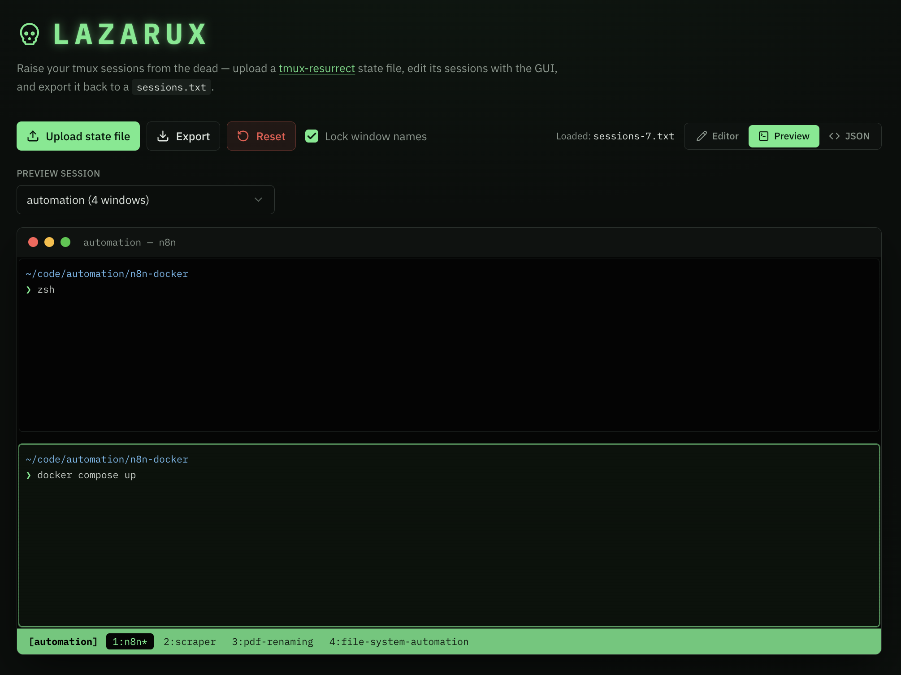

# Lazarux

> _Raise your tmux sessions from the dead._

A web GUI for editing [tmux-resurrect](https://github.com/tmux-plugins/tmux-resurrect)
session state. Upload a `~/.tmux/resurrect/` save file, reshape your sessions,
windows, and panes visually, preview the result as a dummy terminal, and export
a `sessions.txt` you can restore — all in the browser, no backend.

Useful when you want to reorganize a restored tmux workspace: rename sessions,
split a giant session into several, reorder windows, move a window from one
session to another, or clean up after a messy restore.



## Why?

I had accumulated *way* too many tmux sessions, windows, and panes — dozens of
sessions, well over a hundred windows. Reorganizing all of that from inside tmux
was painful: `move-window`, `swap-window`, `move-pane`, renaming things one at a
time, juggling indexes, and constantly losing my place. There was no way to step
back and see the whole layout, let alone drag things around.

Since [**tmux-resurrect**](https://github.com/tmux-plugins/tmux-resurrect)
already persists my entire workspace to a plain text file under
`~/.tmux/resurrect/`, the obvious move was to edit *that* instead of poking at a
live tmux server. Lazarux gives you a bird's-eye GUI over that save file —
collapse the noise, drag windows between sessions, reorder and reindex in bulk —
then export a `sessions.txt` you restore with `prefix + Ctrl-r`. Reorganizing a
sprawling workspace goes from a tedious sequence of tmux commands to a few
minutes of clicking and dragging.

> **Lazarux is specifically a tool for
> [tmux-resurrect](https://github.com/tmux-plugins/tmux-resurrect).** It reads and
> writes that plugin's save format — you'll want tmux-resurrect installed and a
> saved session (`prefix + Ctrl-s`) to get the most out of it.

## Features

- **Round-trips losslessly** — parsing a save file and re-exporting it (with no
  edits) produces a byte-for-byte identical file.
- **Multi-session editor** — collapsible session/window list; edit session names,
  window names/flags/layout, and pane paths/commands/titles.
- **Drag & drop** windows to reorder within a session or move them to another
  (with viewport edge auto-scroll for long lists), or use the **Move** dialog.
- **Reorder / reindex** — move sessions up/down; renumber a session's windows to
  match their order (tmux restores windows by index, not file order).
- **Terminal preview** — a dummy terminal that renders a session's active window
  by parsing the tmux layout string into real pane rectangles, with a session
  dropdown and a clickable tmux-style window bar.
- **Autosave** — the current config is kept in `localStorage`, so a refresh
  doesn't lose your work. A **Reset** button clears everything.
- **Guards the two tmux footguns** (see below): session-name prefix collisions
  and window names lost to `automatic-rename`.

## Getting started

Requires Node.js 18+ (developed on 24).

```bash
npm install
npm run dev      # http://localhost:3000
```

Build / run production:

```bash
npm run build
npm run start
```

### Typical workflow

1. **Upload** your latest save (`~/.tmux/resurrect/last` — copy it to `*.txt`),
   or click **New file** to start from scratch.
2. Edit sessions/windows/panes; check the **Preview** tab to sanity-check a
   session's layout.
3. **Export sessions.txt** and drop it back into `~/.tmux/resurrect/` (overwrite
   the file `last` points to), then restore in tmux with `prefix + Ctrl-r`.

## The two tmux footguns it guards against

**1. Session-name prefix collisions.** tmux resolves a session target by exact
match first, then by *prefix* — so `has-session -t "automation"` matches an existing
session `automation - home`. On restore, tmux-resurrect skips creating the shorter-named
session and merges its windows into the longer one. The app flags any session
whose name is a prefix of another, inline and in a banner.

**2. Window names lost to `automatic-rename`.** If your tmux has
`automatic-rename on` (the default), restored window names get immediately
overwritten by each window's running command (`zsh`, `node`, …). The **Lock
window names** option (on by default) writes `automatic_rename=off` for every
window on export, so the names you set survive the restore regardless of your
global tmux setting. (Equivalent to adding `set -g automatic-rename off` to your
`~/.tmux.conf`.)

## The data model

tmux-resurrect's format is tab-separated lines (`pane`, `window`, `state`), with
the session name on every line and a single `state` line for the attached
session. The app parses this into a structured, JSON-friendly shape:

```jsonc
{
  "sessions": [
    {
      "name": "automation",
      "windows": [
        {
          "index": 1,
          "name": "scraper",
          "active": 1,
          "flags": "*",
          "layout": "b9fe,187x52,0,0,1",
          "automaticRename": "off",
          "panes": [
            { "index": 1, "title": "", "path": "/code/automation/scraper",
              "active": 1, "command": "zsh", "fullCommand": "" }
          ]
        }
      ]
    }
  ],
  "activeSession": "automation",
  "hasTrailingNewline": true
}
```

tmux-resurrect guards certain fields with a leading `:`; the parser strips it and
the serializer re-adds it, which is what makes the round-trip lossless.

## Project structure

```
src/
  app/
    layout.tsx          Root layout + fonts
    page.tsx            Toolbar, persistence, view switching (Editor/Preview/JSON)
    globals.css         Theme tokens + Tailwind
    components/
      Editor.tsx        Session/window/pane editor (drag & drop, dialog)
      Preview.tsx       Dummy terminal + tmux layout renderer
  components/ui/        shadcn/ui primitives
  lib/
    types.ts            Shared types (ResurrectDoc, Session, TmuxWindow, Pane)
    resurrect.ts        parse / serialize (pure, no DOM/fs)
    model.ts            Factories + normalization helpers (pure)
    utils.ts            cn() class-name helper
```

## Tech stack

- Next.js (App Router)
- React
- TypeScript
- Tailwind CSS v4
- shadcn/ui (Radix).

## License

Opens source under the MIT License.

Built with ❤️ by [aeksco](https://x.com/aeksco)